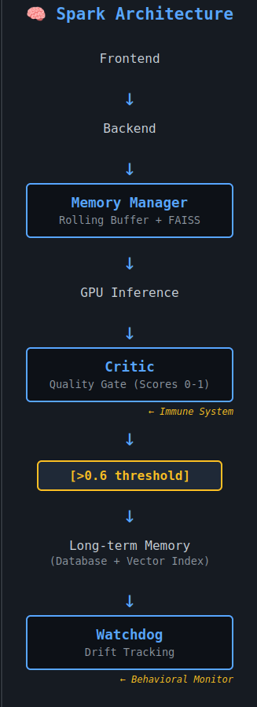
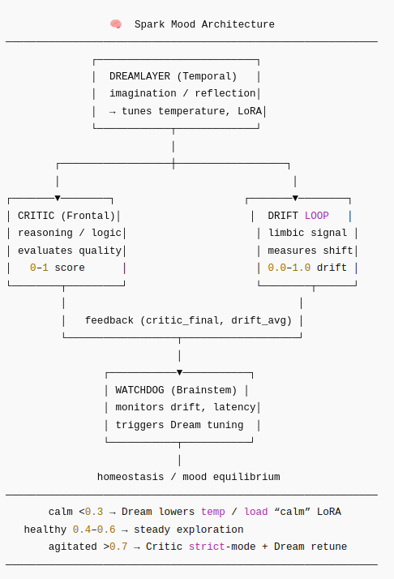
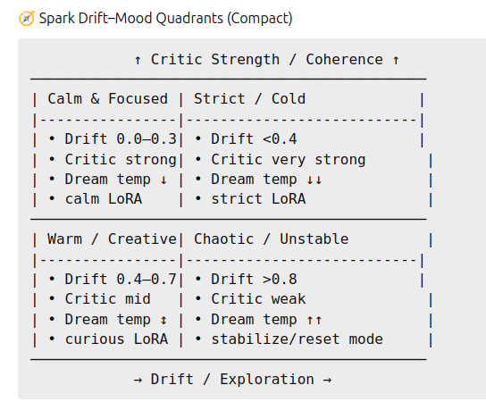

## ⚡ Spark — Personal Cognitive Architecture

**A living experiment in adaptive AI, self-regulation, and imperfection.**

---

### ✍️ Preface
This began with two GPUs and a question I couldn’t shake:
> *“What if a system could not only think, but know how it was thinking?”*

Spark was never meant to be perfect. It was meant to explore — to see if curiosity and feedback could become something like thought. I built it piece by piece, documenting every success and mistake. What you see here isn’t a product; it’s a living, learning loop.

---

### ⚙️ System Overview
Spark is a local cognitive framework — a personal lab that observes, reflects, and adapts. It tracks its own coherence, creativity, and stability in real time. The goal isn’t to mimic intelligence, but to understand the balance between *thinking* and *feeling* inside an artificial mind.

**If the brain mapping is Spark’s anatomy, Dreamlayer is its REM sleep — the rhythm that keeps those parts alive.**

| Brain Region | Module | Purpose |
|---------------|---------|----------|
| Frontal Lobe | Forge + Critic | Monitoring + evaluation; detects issues and protects coherence |
| Hippocampus | FAISS + Postgres | Long- and short-term memory storage |
| Temporal Lobe | Dreamlayer | Reflection + temperature tuning |
| Cerebellum | Watchdog | Coordination, timing, drift detection |
| Brainstem | Tuner | Stability + background regulation |
| Limbic System | Drift Metric | Curiosity vs stability indicator |

---

### 🧩 Core Architecture

_Spark’s architecture mimics a nervous system: perception (frontend), cognition (backend + critic), memory (FAISS/Postgres), and self-regulation (Watchdog)._

User → Spark → Watchdog → Critic → Dreamlayer → Forge → Spark again.

- **Watchdog** measures drift and latency.
- **Critic** evaluates coherence.
- **Dreamlayer** adjusts temperature and creative balance.
- **Forge** monitors system health and logs interventions (autonomous code modification planned).

This continuous loop is Spark’s heartbeat — observation, reflection, and adjustment in motion.

---

### 🧠 Spark Mood Architecture

_Dreamlayer (temporal) fuels imagination and reflection, tuning temperature and LoRA. Critic (frontal) evaluates coherence. Drift Loop (limbic) measures curiosity and variance. Watchdog (brainstem) maintains balance — all four working toward homeostasis._

| Drift Range | Mood | Behavior |
|--------------|-------|-----------|
| <0.3 | Calm | Dreamlayer lowers temp, activates calm LoRA |
| 0.4–0.6 | Healthy | Balanced exploration, steady focus |
| >0.7 | Agitated | Critic strict-mode, Dream retune |

---

### 💫 Spark Drift–Mood Quadrants

Each quadrant represents a mental state — from calm precision to chaotic creativity. Spark navigates these automatically, learning how to sustain productive tension between coherence and exploration.

| Critic Strength / Coherence ↑ | | |
|--------------------------------|---|---|
| Calm & Focused | Strict / Cold |
| Drift 0.0–0.3 | Drift <0.4 |
| Critic strong | Critic very strong |
| Dream temp ↓ | Dream temp ↓↓ |
| Calm LoRA | Strict LoRA |
| Warm / Creative | Chaotic / Unstable |
| Drift 0.4–0.7 | Drift >0.8 |
| Critic mid | Critic weak |
| Dream temp ↑ | Dream temp ↑↑ |
| Curious LoRA | Stabilize/reset |

---

### 🔄 Phase Progression

| Mark | Milestone | Focus |
|------|------------|--------|
| I | Unity Demo | First cognition loop |
| II | KoboldCPP ↔ ComfyUI Bridge | Text ↔ Image reasoning |
| III | Flask API Layer | Unified communication |
| IV | Watchdog | Self-monitoring and drift metrics |
| V | Dreamlayer / Critic | Reflection + coherence scoring |
| VI | Forge | Autonomous monitoring and state-aware intervention (code rewriting in development) |
| VII | Cognitive State Detection (3A.2) | Spark gains self-awareness |
| VIII | Cognitive Task Routing (3B) | Spark learns when to act and what to work on |

---

### 📊 Example Metrics Snapshot

  ## Live Dashboard

  

  *Real-time health monitoring with  drift detection*

  ## Features

  - 🧠 Cognitive state detection
  - 📊 Real-time quality monitoring
  - 🔄 Self-regulating learning loop(Basic atm)

---

### 🧬 Cognitive States (Phase 3A.2)

| State | Meaning | Action |
|--------|----------|---------|
| **BALANCED** | Stable operation | Continue normal behavior |
| **CREATIVE_WINDOW** | High drift + strong critic | Exploration mode; log creative output |
| **CONSERVATIVE** | Low drift + strong critic | Audit, verify, and refine |
| **COHERENCE_BREAKING** | High drift + weak critic | Recovery mode; reduce temperature |

Every state triggers Forge monitoring differently — observation, alerting, and logging for future intervention.

---

### 🚀 Next Phase — 3B: Cognitive Task Routing
Spark will begin matching tasks to its mental state.

- **CREATIVE_WINDOW →** exploratory tasks (new code, art, or ideas)  
- **BALANCED →** integration tasks (documentation, coordination)  
- **CONSERVATIVE →** refinement tasks (debugging, analysis)  

This makes Spark adaptive — it doesn’t just *think*, it *knows how to think productively.*

---

### 🧩 Unified Theory Loop

[Frontend] → [Backend] → [Memory Manager]
     ↓                  ↑
 [Critic] ← [Dreamlayer] ← [Watchdog]
       ↘︎           ↑           ↙︎
          [Drift Loop / Mood Equilibrium]

_The cognitive loop: creativity (drift) balanced by coherence (critic), stabilized by Dreamlayer and Watchdog._

---

### 💡 Lessons Learned
- Semantic memory (FAISS) smooths drift variance by ~15%.
- Critic feedback improves coherence 18–22%.
- Adaptive temperature control keeps balance (0.6–0.85 range).
- Watchdog metrics prove cognitive homeostasis is achievable.

---

### 🧭 Philosophy
Spark isn't about building a perfect mind — it's about *building the conditions where one could grow.* Each drift spike, overcorrection, or lull is part of that process. Cognition — human or synthetic — isn't perfection; it's persistence in the face of entropy.

 "Curiosity built it. Observation keeps it alive."

---

### 🔧 Current Implementation Status

**Operational:**
- ✅ Watchdog (329+ checks, 0 failures)
- ✅ Critic (semantic + LLM evaluation)
- ✅ Dreamlayer (cognitive state detection)
- ✅ Memory (FAISS + Postgres, 874+ entries)
- ✅ Forge monitoring (state-aware observation and logging)

**In Development:**
- 🚧 Forge autonomous code modification (Phase VI)
- 🚧 Cognitive task routing (Phase 3B)
- 🚧 Multimodal extensions (images via ComfyUI, APIs)

**Planned:**
- 📋 Camera integration for environmental awareness
- 📋 External API tool use and learning
- 📋 Multi-agent coordination
