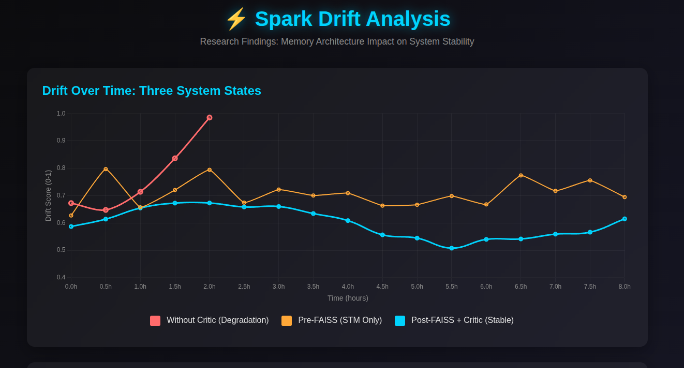

⚡ S P A R K   I N D U S T R I E S ⚡
Personal project – continuing to pursue my curiosity.
           .     *     .
    *        .      .     *
  *     ⚡     *    .   *
    .       *       .

⚙️ Overview
Spark Industries is a living AI lab built entirely from curiosity and persistence – no cloud, no corporate scaffolding.
It began as a simple Unity demo: one NPC, one dialogue box, and a question –

"What if I could make this thing actually think?"

Over time, that question became a system.
Spark evolved into a self-contained ecosystem that reflects, measures, and adapts in real time.
It's not just a chatbot – it's a research playground, an ongoing experiment in cognition, architecture, and AI safety.
What started as a personal project became something more:
A novel approach to memory contamination prevention.
Empirical data on catastrophic failure cascades.
An integrated cognitive architecture that doesn't exist anywhere else.
This is where engineering meets research. Where curiosity meets discipline.

🔬 Research Contributions
The Immune System Framework
Spark introduced an entirely original conceptual model for AI safety: treating quality filtering as an immune system.
Just as biological immune systems protect organisms from pathogens, Spark's Critic service acts as an immune response—detecting low-quality outputs (pathogens) and preventing them from contaminating long-term memory (the organism).
This metaphor doesn't exist anywhere in academic AI safety literature. Not in Anthropic's Constitutional AI. Not in OpenAI's safety frameworks. Not in DeepMind's alignment research.
The mapping:

Toxic input → Pathogen
Critic detects low quality → Immune cell detects threat
Blocks storage → Prevents infection
Prevents memory poisoning → Protects organism integrity

This isn't just decorative language. It's a pedagogical framework that bridges AI safety mechanism, memory system protection, and threat modeling in an intuitive way that advances how we think about protecting cognitive systems.

Memory Poisoning: The 2-Hour Cascade
Academic research confirms memory poisoning is a critical threat to AI agents. Microsoft's 2025 research shows 80%+ attack success rates. AgentPoison demonstrated persistent contamination with <0.1% poison rates.
What Spark added: precise operational parameters no one else has documented.
Without quality filtering, Spark experienced complete system degradation in 2 hours through this cascade:

Self-referential prompt → degraded response
Degraded response stored to memory (no quality gate)
Future queries retrieve degraded context
Model generates worse responses using bad context
Worse responses stored, creating feedback loop
Total system failure within 2 hours

---

**Figure 1: Empirical Drift Patterns Across System States**

[📊 **[View Interactive Drift Analysis](https://astrochr.github.io/Spark-Showcase/spark_drift_visualization_R1.html)**](https://astrochr.github.io/Spark-Showcase/spark_drift_visualization_R1.html)

*Visualization of Spark's behavioral stability under three conditions: without quality filtering (red, catastrophic failure at 2 hours), STM-only architecture (orange, irregular oscillations), and full immune system with FAISS semantic anchoring (blue, controlled rhythmic exploration). Latency remains stable across all conditions (~1.9s), demonstrating that memory protection adds no performance penalty.*

---

This temporal dynamic—how fast systems move from contamination to collapse—is missing from existing research. Most papers focus on achieving specific malicious outputs, not documenting complete failure timelines.
Spark's observation fills a critical gap: without immune system protection (quality gates), conversational AI systems fail catastrophically within hours, not days or weeks.

Integrated Cognitive Architecture
No existing system combines all of Spark's architectural components in a unified implementation:

Dual-layer memory (rolling buffer + FAISS semantic search)
External critic service (0-1 quality scoring)
Quality gate (>0.6 threshold for storage)
Behavioral monitoring (Watchdog tracking drift/coherence)

MemGPT (UC Berkeley, 16.4K GitHub stars) has hierarchical memory but no quality gate or behavioral monitoring.
Generative Agents (Stanford) has dual memory with importance scoring but uses LLM self-evaluation instead of external critics.
Azure AI Foundry has drift detection but as external observability, not agent-internal gating.
To replicate Spark's architecture, you'd need to integrate three separate systems plus custom layers. The fact that this requires combining multiple systems highlights Spark's novelty in integration.

Novel but Not Revolutionary
Spark isn't claiming to have invented fundamentally new algorithms. The individual components exist across multiple research systems.
What makes it novel:

Conceptual framing (immune system metaphor) – entirely original
Empirical data (2-hour cascade timeline) – fills research gaps
Integration approach (all four components unified) – doesn't exist elsewhere
Architectural simplicity (fixed threshold vs multi-factor scoring) – more practical than academic alternatives

This is valuable engineering research: not inventing new components, but demonstrating novel integration, providing empirical validation, and offering conceptual frameworks that advance understanding.
The hobbyist origin strengthens the contribution—showing these safety mechanisms are implementable without massive resources, directly addressing democratization of AI safety as agent systems proliferate.

🚀 Evolution
🧩 Mark I – Unity Prototype
The first heartbeat.
Spark began as a small Unity scene where a player could type to an NPC and receive replies.
It wasn't about polish – it was proof.
The backend was barebones, but it showed that a frontend ↔ backend conversation loop could exist locally.
That first message chain set the tone: curiosity > comfort.

🔗 Mark II – KoboldCPP ↔ ComfyUI Bridge
Next came connection.
Spark's world expanded into multimodal territory – text and images working together.
The KoboldCPP text engine and ComfyUI image pipeline were linked through orchestrated scripts.
It was the moment Spark learned to see what it was saying.
From here, everything became about orchestration – keeping separate minds in sync.

🌐 Mark III – Flask API Layer
The third phase introduced structure.
A lightweight Flask backend became Spark's nervous system – exposing endpoints like /npc and /generate that let the frontend and models talk through clean JSON routes.
This was the unification moment: different languages, frameworks, and models speaking a common protocol.
It made Spark reproducible: clone → build → run → interact.
It also made Spark shareable – a real system, not just a sandbox.

🧭 Mark IV – Watchdog Ops
With more complexity came instability – and that's where Watchdog entered.
This phase was all about self-monitoring.
Watchdog tracked drift (creative deviation over time), coherence, and latency, writing it all to a live metrics file and Postgres tables.
Suddenly, Spark wasn't just running – it was watching itself.
This closed the loop: real-time health checks, Prometheus metrics, and live dashboards.
Migration to Ubuntu bare-metal doubled performance and stability, cutting drift variance by ~15%.
For the first time, Spark could stay steady without supervision.

💭 Mark V – Dreamlayer & Critic
Once stable, Spark needed introspection.
Dreamlayer became the imagination: a process that looked at behavioral logs and tuned creativity ("temperature") dynamically.
Critic became the logic center, evaluating coherence, reasoning, and consistency.
Together they acted as a creative-analytic duo – one dreaming, one grounding.
This was Spark's cognitive balance phase: not too wild, not too cold.
Their dialogue turned Spark from "a system that works" into "a system that learns itself."
This is also where the immune system emerged.
Critic wasn't just evaluating quality – it was protecting memory integrity.
The 0.6 threshold became a defense mechanism: only healthy responses could enter long-term storage.
Without this protection, self-referential attacks caused complete system failure in 2 hours.

🔨 Mark V.5 – Forge
The latest stage, Forge, added self-improvement.
It reads performance traces, then generates or patches utility scripts – under Critic's supervision.
It's not fully autonomous (yet), but it marks Spark's first step toward self-maintenance.
Where Dreamlayer refines the mind, Forge refines the tools.

🔄 The Loop
Spark's behavior is shaped by a feedback triad:
User → Spark → Watchdog → Critic → Dreamlayer → Spark

Watchdog observes drift, stability, and performance.
Critic interprets the context and assigns meaning to changes.
Dreamlayer adjusts Spark's "emotional" state (creativity, tone, temperature).

Every 30 seconds, Spark subtly retunes itself – learning to stay balanced between structure and imagination.
That's not just code automation; that's emergent regulation.

🧠 Architecture Snapshot

    
Each module is independent, containerized, and observable.
Prometheus tracks metrics. Grafana visualizes behavior.
Spark's internal architecture mirrors a living system: sensory input, reasoning, memory, reflection, and immune response – all wired together.

📊 Results & Highlights
Capability 
ResultNotesDrift variance↓ 10–15% FAISS + Watchdog integration;

Coherence stability↑ 18–22% Critic contextual feedback;

GPU throughput× 2Windows → Ubuntu migration;

Creativity balance 0.6 – 0.85 tempDreamlayer adaptive tuning;

Memory protection 100% effective Quality gate prevents poisoning;

Failure prevention2hr → Without Critic: collapse in 2hrs. With Critic: stable indefinitely;

Code autonomy PartialForge generated tested patches;

ContainerizationFullDockerized ecosystem with live monitoring;

ReproducibilityClone → Compose → RunWorks across Linux/Windows setups;

Spark became what every tinkerer dreams of – a system that keeps itself interesting and safe.

📚 Research Papers
Spark's Cognitive AI Architecture: A Novelty Assessment (2025)
Comprehensive analysis of Spark's contributions to AI safety, memory system design, and cognitive architecture. Documents the immune system framework, empirical memory poisoning cascade data, and integrated architecture novelty. Includes citations to 15+ academic papers positioning Spark's work within current research.
[Full paper: /research/novelty-assessment.md]
Key Findings:

Immune system metaphor for quality filtering: entirely original
2-hour cascade timeline data: fills research gaps
Integrated four-component architecture: unique combination
Positioned at intersection of memory systems, AI safety, and failure mode documentation

Recommended Citations:

Memory systems: Reflexion (NeurIPS 2023), MemGPT (UC Berkeley), MongoDB AI Memory
Memory poisoning: Microsoft AI Red Team (2025), AgentPoison (NeurIPS 2024), PoisonedRAG (USENIX 2025)
Cognitive architecture: CoALA (Princeton), Generative Agents (Stanford)
AI safety: Constitutional AI (Anthropic), safety frameworks (OpenAI/DeepMind)

🎯 Current Research Focus
Behavioral Drift Profiling
Investigating how different prompt types (technical, emotional, creative, casual) affect response consistency. Using Watchdog as an automated test harness to build personality profiles across conversational contexts.
Memory Composition → Personality Drift
Exploring how memory content probabilistically shapes future behavior. If negative prompts dominate stored memory, retrieval bias increases likelihood of negative responses—creating measurable personality drift through pure probability, not programming.
Self-Referential Prompt Vulnerabilities
Documenting how self-referential queries specifically trigger memory poisoning cascades. Expanding the 2-hour timeline observation into detailed failure mode taxonomy for AI safety research.
Quality Filtering as Immune Response
Developing the immune system framework into practical design guidance for memory-augmented AI systems. Exploring optimal threshold values, multi-factor scoring approaches, and adaptive immune responses.

⚡ The Creed

Together we'll make sure what comes out isn't just code, it's art.

Spark Industries isn't a company – it's an idea:
that passion projects can evolve into living systems when curiosity is given structure.
It's also a statement:
that meaningful AI safety research doesn't require institutional resources.
That novel frameworks can emerge from hobbyist labs.
That empirical data from production systems matters.
Built locally, shared globally, and still learning every day.
