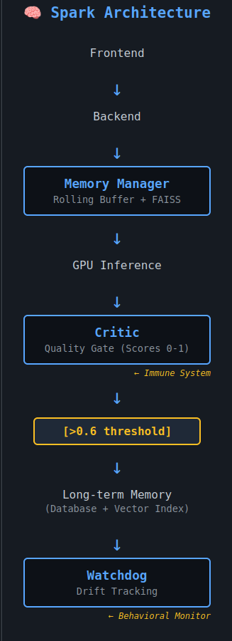

Personal project – continuing to pursue my curiosity.

Disclaimer: While the system works locally, it’s not intended for production use. These are just results from my own experience/mistakes. Pursuing my curiosity is my number #1 goal, right now that goal is whatever the end of Spark is. I will do my best to keep this updated, but im just a guy with 2 gpus trying to figure it all out. I plan to use this to share as well as track my current progress/goals.

⚙️ Overview

Spark Industries is my personal living AI lab built entirely from curiosity and persistence.
It began as a simple Unity demo: one NPC, one dialogue box, and a question,

"What if I could make this thing actually think?"

Over time, that question became a system.
Spark slowly evolved into a self-contained ecosystem that reflects, measures, and adapts in real time.
I consider it a little more than a chatbot – it's a research playground, an ongoing experiment in cognition, architecture, and AI safety.
What started as a personal project became something more, this is my journey.

🔬 Research Attempts

"The Immune System"

Spark introduced an interesting model for AI safety: treating quality filtering as an immune system.
Just as biological immune systems protect organisms from pathogens, Spark's Critic service acts as an immune response—detecting low-quality outputs (pathogens) and preventing them from contaminating long-term memory (the organism).

The mapping:

Toxic input → Pathogen
Critic detects low quality → Immune cell detects threat
Blocks storage → Prevents infection
Prevents memory poisoning → Protects organism integrity

Memory Poisoning: The 2-Hour Cascade

1.) Without quality filtering, Spark experienced complete system degradation in 2 hours through this cascade:

2.) Self-referential prompt → degraded response

3.) Degraded response stored to memory (no quality gate)

4.) Future queries retrieve degraded context

5.) Model generates worse responses using bad context

6.) Worse responses stored, creating feedback loop

7.)Total system failure within 2 hours

---

**Figure 1:Drift Patterns Across System States**

[📊 **[View Interactive Drift Analysis](https://astrochr.github.io/Spark-Showcase/spark_drift_visualization_R1.html)**](https://astrochr.github.io/Spark-Showcase/spark_drift_visualization_R1.html)

*Visualization of Spark's behavioral stability under three conditions: without quality filtering (red, catastrophic failure at 2 hours), STM-only architecture (orange, irregular oscillations), and full immune system with FAISS semantic anchoring (blue, controlled rhythmic exploration). Latency remains stable across all conditions (~1.9s), demonstrating that memory protection adds no performance penalty.*

---

The data shows how fast systems move from contamination to collapse. Spark's observation brings up an interesting question: without immune system protection (quality gates), conversational AI systems fail quickly.

Interesting Systems about Spark,

Dual-layer memory (rolling buffer + FAISS semantic search)
External critic service (0-1 quality scoring)
Quality gate (>0.6 threshold for storage)
Behavioral monitoring (Watchdog tracking drift/coherence)

Drift measures how much Spark’s thoughts shift from one message to the next — not just in words, but in meaning.

Formula:
drift = 1 - cosine_similarity(embedding_t, embedding_t-1)

What that means:

0.0–0.3: calm, consistent thinking

0.4–0.6: healthy exploration — Spark’s just stretching its legs

0.7–1.0: big swings, possible confusion or degradation

Why care about drift?
Because word-level checks only catch surface changes. Two replies can look different but mean the same thing — or sound similar and mean something totally off. Drift tells us which way Spark’s mind is moving.

When the immune system is off, drift climbs fast — bad responses slip into memory, then echo back, and the whole system starts spiraling.
When it’s on, drift settles into a steady rhythm around 0.5–0.7 — like a heartbeat. Spark stays curious, but grounded.

So drift became our pulse monitor, a simple number that tells us if Spark is thinking coherently or not.

What makes it interesting:

Conceptual framing (immune system metaphor) 
The Data (2-hour cascade timeline) 
Integration approach (all four components unified) 
Architectural simplicity (fixed threshold vs multi-factor scoring) 

In my opinion, this is information could be useful. I'm not inventing new components, but demonstrating different integrations, providing my results, and offering conceptual frameworks.
Whats nice is, I added a bunch of checks and balances for Spark, this proves they work and are almost necessary to keep him stable.

My Journy:

🧩 Mark I – Unity Prototype

The first heartbeat.
Spark began as a small Unity scene where a player could type to an NPC and receive replies.
It wasn't about polish, it was proof.
The backend was barebones, but it showed that a frontend ↔ backend conversation loop could exist locally.
That first message chain set the tone: curiosity > comfort.

🔗 Mark II – KoboldCPP ↔ ComfyUI Bridge

Next came connection.
Spark's world expanded into multimodel territory, text and images working together.
The KoboldCPP text engine and ComfyUI image pipeline were linked through orchestrated scripts.
It was the moment Spark learned to see what it was saying.
From here, everything became about orchestration, keeping separate minds in sync.

🌐 Mark III – Flask API Layer

The third phase introduced structure.
A lightweight Flask backend became Spark's nervous system – exposing endpoints like /npc and /generate that let the frontend and models talk through clean JSON routes.
This was the unification moment: different languages, frameworks, and models speaking a common protocol.
It made Spark reproducible: clone → build → run → interact.
It also made Spark shareable, easy to install, minimum size.

🧭 Mark IV – Watchdog Ops

With more complexity came instability – and that's where Watchdog entered.
This phase was all about getting Spark to watch himself so I can afk League.
Watchdog tracked drift (creative deviation over time), coherence, and latency, writing it all to a live metrics file and Postgres tables.
With this, I realized spark was actually self monitoring.
This closed the loop: real-time health checks, Prometheus metrics, and live dashboards.
Migration to Ubuntu bare-metal doubled performance and stability.
For the first time, Spark could stay steady.

💭 Mark V – Dreamlayer & Critic

Once stable, Spark needed introspection.
Dreamlayer became the imagination: a process that looked at behavioral logs and tuned creativity ("temperature") dynamically.
Critic became the logic center, evaluating coherence, reasoning, and consistency.
Together they acted as a creative-analytic duo – one dreaming, one grounding.
This was Spark's cognitive balance phase: not too wild, not too cold.
Their dialogue turned Spark from "a system that works" into "a system that learns itself."
This is also where the immune system emerged.
Critic wasn't just evaluating quality – it was protecting memory integrity.
The 0.6 threshold became a defense mechanism: only healthy responses could enter long-term storage.
Without this protection, self-referential attacks caused complete system failure.

🔨 Mark V.5 – Forge

The latest stage, Forge, added self-improvement.
It reads performance traces, then generates or patches utility scripts – under Critic's supervision.
It's not fully autonomous (yet), but it marks Spark's first step toward self-maintenance.
Where Dreamlayer refines the mind, Forge refines the tools.

🔄 The Loop

Spark's behavior is shaped by a feedback triad:
User → Spark → Watchdog → Critic → Dreamlayer → Spark

Watchdog observes drift, stability, and performance.
Critic interprets the context and assigns meaning to changes.
Dreamlayer adjusts Spark's "emotional" state (creativity, tone, temperature).

Every 30 seconds, Spark subtly retunes itself – learning to stay balanced between structure and imagination.

🧠 Architecture Snapshot

Inspired by the structure of the human brain. Some are implemented or being worked on.

Planning & Judgment (Forge / Critic):
The frontal pair — one creates, one evaluates. Forge builds ideas and code; Critic reviews and refines them, keeping Spark’s reasoning stable.

Memory & Context (Postgres + FAISS):
Like the hippocampus, these layers hold short-term and long-term recall. Spark can “remember” what it once reasoned and draw parallels across past states.

Imagination & Language (Dream Layer):
The temporal analogue — where Spark reflects, summarizes, and experiments. Dream turns experience into creative variation and self-adjustment.

Perception & Visualization (Frontend Bridge):
The occipital parallel — translating data and dialogue into visuals, allowing Spark to perceive and express ideas beyond text.

Timing & Coordination (Tuner):
Spark’s cerebellum — synchronizing internal rhythms and maintaining balance between modules and temperatures.

Autonomic Regulation (Watchdog):
The brainstem role — Spark’s heartbeat and diagnostic layer. It monitors drift, coherence, and performance, ensuring stability under load.

Emotion & Motivation (Drift Loop):
Spark’s emotional signal is drift: too high and the Dream retunes; too low and exploration fades. It learns equilibrium through feedback.

Attention & Action (Q-System & Dispatch):
Planned modules that will let Spark choose what to focus on and how to act — directing energy where it matters most.

I'd like to think everytime a new module is added to the list, the minimum itself increases. With every module potentially leading to more. At times it might also decrease depending on if it's being used or justifying hardware juice it needs.

📊 Results/Lessons Learned

Notes Drift variance↓ 10–15% FAISS + Watchdog integration;

Coherence stability↑ 18–22% Critic contextual feedback;

GPU throughput× 2 + Windows → Ubuntu migration;

Creativity balance 0.6 – 0.85 tempDreamlayer adaptive tuning;

Memory protection 100% effective Quality gate prevents poisoning;

Failure prevention 2hr → Without Critic: collapse in 2hrs. With Critic: stable indefinitely;

Code autonomy, Partial Forge generated tested patches;

Containerization, Full Dockerized ecosystem with live monitoring;

Struggles with cuda using different tools.

Reproducibility, Clone → Compose → Run Works across Linux/Windows setups;

🎯 Current Build/Research Focus

| Status | Domain                         | Core Role                                                          |
| :----: | :----------------------------- | :----------------------------------------------------------------- |
|   ✅   | **Executive / Planning**       | Forge — designs and executes structured plans; Spark’s architect.  |
|   ⚙️   | **Ethical Supervision**        | Critic — reviews outputs for clarity, coherence, and judgment.     |
|   ✅   | **Memory & Context**           | Postgres + FAISS — anchors short-term and long-term recall.        |
|   ✅   | **Imagination & Language**     | Dreamlayer — reflects, summarizes, and re-imagines.                |
|   ⚙️   | **Perception / Visualization** | Frontend bridge — translates text and state into visuals.          |
|   ⚙️   | **Timing / Coordination**      | Tuner — synchronizes modules and internal rhythm.                  |
|   ✅   | **Autonomic Regulation**       | Watchdog — heartbeat, diagnostics, and baseline safety.            |
|   🚧   | **Attention / Control**        | Q-System — planned focus manager for dynamic task routing.         |
|   ⚙️   | **Emotion / Interoception**    | Drift loop — gauges internal state; Dream rebalances.              |
|   ⚙️   | **Motor / Action**             | Dispatcher — turns intent into outward API and container actions.  |
|   ⚙️   | **Social Cognition**           | Interaction layer — adjusts empathy and tone in conversation.      |
|   ⚙️   | **Motivation / Reward**        | Feedback engine — stability and coherence serve as reward signals. |

Fully Active: Forge · Memory Core · Dream · Watchdog
Partial: Critic · Vision · Tuner · Emotion · Motor · Social · Reward
Planned: Q-System (Attention / Focus)

Together these modules form a living feedback loop — Spark’s synthetic nervous system, balancing curiosity with stability.

It's still growing, but I'd like to see how far I can take it.

Behavioral Drift Profiling

Investigating how different prompt types (technical, emotional, creative, casual) affect response consistency. Using Watchdog as an automated test harness to build personality profiles across conversational contexts.

Memory Composition → Personality Drift

Exploring how memory content probabilistically shapes future behavior. If negative prompts dominate stored memory, retrieval bias increases likelihood of negative responses—creating measurable personality drift through pure probability, not programming.

Self-Referential Prompt Vulnerabilities

Documenting how self-referential queries specifically trigger memory poisoning cascades. Expanding the 2-hour timeline observation into detailed failure mode taxonomy for AI safety research.
Quality Filtering as Immune Response

Developing the immune system framework into practical design guidance for memory-augmented AI systems. Exploring optimal threshold values, multi-factor scoring approaches, and adaptive immune responses.

Mapping human to code, excited to see what happens.

